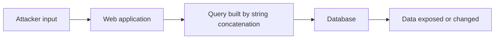

# SQL Injection

> **Last reviewed:** 2026-10-10 | **Status:** Reviewed

## Standards mapping

| Framework | Reference |
|---|---|
| OWASP Top 10:2025 | A05:2025 - Injection |
| MITRE ATT&CK (v19) | Initial Access / T1190 Exploit Public-Facing Application |
| CWE | CWE-89 Improper Neutralization of Special Elements used in an SQL Command |
| CAPEC | CAPEC-66 SQL Injection |
| Example CVE | CVE-2023-34362 (MOVEit Transfer) |

## What it is

SQL injection happens when an application builds a database query by pasting user input into SQL text. The database cannot tell which part the developer wrote and which part the attacker supplied, so the attacker can change what the query does. Depending on the database and its permissions, that can mean reading data they should not see, changing or deleting records, bypassing logins, or in some setups running commands on the database server.

## How it works



The three families differ in how the attacker gets results back:

- **In-band:** results appear in the response. Error-based attacks read data out of error messages; UNION-based attacks append their own result set to the original query.
- **Blind (inferential):** nothing useful is returned, so the attacker asks yes/no questions. Boolean-based attacks watch for differences in the page; time-based attacks watch for delays.
- **Out-of-band:** the database is made to contact an attacker-controlled server (DNS or HTTP) to carry data out. This depends on database features that are often disabled.

A fourth case is easy to miss: **second-order injection**. The attacker's input is stored safely, then later pasted into a query by a different part of the application.

## Real-world example

Starting May 27, 2023, the Cl0p ransomware group exploited a previously unknown SQL injection flaw in Progress Software's MOVEit Transfer file-transfer product (CVE-2023-34362). Attackers installed a web shell called LEMURLOOT on internet-facing servers and used it to steal data from the underlying databases. CISA and the FBI published a joint advisory on June 7, 2023.

Source: [CISA and FBI advisory](https://www.cisa.gov/news-events/news/cisa-and-fbi-release-advisory-cl0p-ransomware-gang-exploiting-moveit-vulnerability)

## Detection

**In web and application logs**

- Request parameters containing quote characters followed by SQL comment sequences (`--`, `#`, `/*`)
- Keywords that do not belong in a normal value: `UNION SELECT`, `information_schema`, `SLEEP(`, `WAITFOR DELAY`, `pg_sleep(`
- Repeated HTTP 500 responses from a single endpoint, or database error text appearing in responses
- Requests that consistently take a fixed number of seconds longer than normal (time-based probing)

**In the database**

- Queries with an unusual shape for that application, or queries against system catalogs
- Unexpectedly large result sets from a normal application account

**Automated checks**

- Static analysis in CI (for example Semgrep or CodeQL) to flag string-built queries before they ship
- Dynamic scanning against a test environment (OWASP ZAP, Burp Suite)

**Scripts in this repository**

- [sql_injection_detector.py](./detection/sql_injection_detector.py): the fuller scanner, with threading, cookies, proxy support and JSON output
- [sql_injection_scanner.py](./detection/sql_injection_scanner.py): a smaller, simpler scanner

Pattern recognition for log review:

| Pattern | What the attacker is trying | What it looks like in a log |
|---|---|---|
| `' OR '1'='1` | Make a condition always true | Quote plus `OR` plus a self-evident true comparison |
| `UNION SELECT` | Append their own result set | `UNION` in a parameter that should hold a name or number |
| `SLEEP(5)`, `WAITFOR DELAY`, `pg_sleep(5)` | Infer data from response time | Delay functions in input, responses about 5 seconds slow |

## Prevention

In order of strength. The first item fixes the cause; the rest reduce risk.

1. **Parameterized queries (prepared statements).** Send the SQL text and the values separately, so input can never be read as SQL. This is the primary defense.
2. **Stored procedures, only if they contain no dynamic SQL.** A procedure that builds its own query by concatenation is just as vulnerable.
3. **Allow-list validation for anything you cannot parameterize.** Table names, column names and sort direction cannot be bound as parameters. Map the user's choice to a fixed set of values you control.
4. **Least privilege.** The application's database account should not own the schema, read system tables, or run administrative commands. This limits what a successful injection can do.
5. **Safe error handling.** Log database errors on the server and show users a generic message. Detailed errors hand attackers a map.
6. **A web application firewall as a stopgap.** It can buy time while a fix ships, but it can be bypassed and is not a substitute for items 1 to 3.

Escaping user input yourself is a last resort for legacy code. It is easy to get wrong, and it is not a replacement for parameterization.

Reference: [OWASP SQL Injection Prevention Cheat Sheet](https://cheatsheetseries.owasp.org/cheatsheets/SQL_Injection_Prevention_Cheat_Sheet.html)

## Code examples

Placeholder syntax depends on the database driver:

| Driver | Placeholder |
|---|---|
| `sqlite3` | `?` |
| `psycopg2` (PostgreSQL) | `%s` |
| `mysql-connector-python` | `%s` |

```python
# Vulnerable: input becomes part of the SQL text
cursor.execute(f"SELECT * FROM users WHERE email = '{user_email}'")

# Safe (sqlite3): the value travels separately
cursor.execute("SELECT * FROM users WHERE email = ?", (user_email,))

# Safe (psycopg2 or mysql-connector)
cursor.execute("SELECT * FROM users WHERE email = %s", (user_email,))
```

Identifiers cannot be parameterized, so use an allow-list:

```python
ALLOWED_SORT_COLUMNS = {"name": "username", "created": "created_at"}

sort_column = ALLOWED_SORT_COLUMNS.get(requested_sort, "username")
cursor.execute(f"SELECT id, username FROM users ORDER BY {sort_column}")
```

Here the f-string is safe only because `sort_column` always comes from the dictionary, never from the user.

Run the full working example (SQLite, Python 3.10+):

```bash
cd prevention/
python parameterized_queries.py
```

- [parameterized_queries.py](./prevention/parameterized_queries.py): secure create, read, search, update and delete, with salted password hashing
- [input_validation.py](./prevention/input_validation.py): input validation helpers

## Common mistakes

- Parameterizing the values but concatenating the column or table name
- Using an ORM's raw-query feature (such as SQLAlchemy `text()`, Django `.raw()` or `.extra()`) with string formatting
- Relying on input validation or quote escaping alone
- Trusting data because it came from your own database (second-order injection)
- Showing raw database errors to users
- Treating a WAF as the fix

## Test it safely

Only test applications you own or have written permission to test. Unauthorized testing is illegal.

Practice targets built to be attacked:

- [OWASP Juice Shop](https://owasp.org/www-project-juice-shop/)
- [DVWA](https://github.com/digininja/DVWA)
- [OWASP WebGoat](https://owasp.org/www-project-webgoat/)

Tools: [sqlmap](https://sqlmap.org/), [OWASP ZAP](https://www.zaproxy.org/), [Burp Suite](https://portswigger.net/burp)

## References

- [OWASP Top 10:2025](https://owasp.org/Top10/2025/)
- [OWASP SQL Injection](https://owasp.org/www-community/attacks/SQL_Injection)
- [MITRE ATT&CK T1190](https://attack.mitre.org/techniques/T1190/)
- [CWE-89](https://cwe.mitre.org/data/definitions/89.html)
- [PortSwigger Web Security Academy: SQL injection](https://portswigger.net/web-security/sql-injection)
